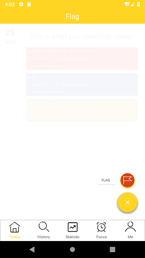
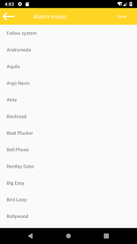

# Flag-Application

Flag application is an integrated Android application of multiple functions which include time manager, schedule alarm, notes record, event statistic, white noise playing and focus timer.

When user launches the App. The logo and slogan shown on the first page leave a good impression on the user. Moreover, it not only stress the usefulness of the application and the aesthetics of the App. The main color tone of the App is yellow which means vitality and positive attitude.

The function of this module is to add a new target event of today by clicking the floating button on the bottom. Furthermore, it also displays what the user needs to do today and provides the looking up function.

The user can sear and look up by clicking the date on the calendar or just scroll the screen. Moreover, by clicking the event card, the user can see the detail of the target event.

The statistic interface displays the statistic information by statistic graphics. With visualized graphics, user can get and understand the information and statistic data better and clearer. 

 Target Event Creating Interface
 
 set the detail information of flag event
 

set the remind settings of the alarm

Next, the focus interface mainly consists of two text views, two buttons and a countdown timer. The countdown timer shoed in a circle shape and user can control it by inputting text or just rotate the button on the timer. It is very convenient to operate.

The last interface shows the information about the user itself and the App. It displayed the head portrait of the user and each item of the list can be clicked to check information.

Youcan also choose to play white moise music to make you calm down:

All the icons designed by a same lifestyle and color. They follow the normal recognition and standard format. And they are clear and easy to understand by the user.

# References
Open source project
License: https://github.com/Tibolte/AgendaCalendarView
The user interface of the calendar and the agenda lists in my application use the design of the framework of the open source project above on the Github.	

 
